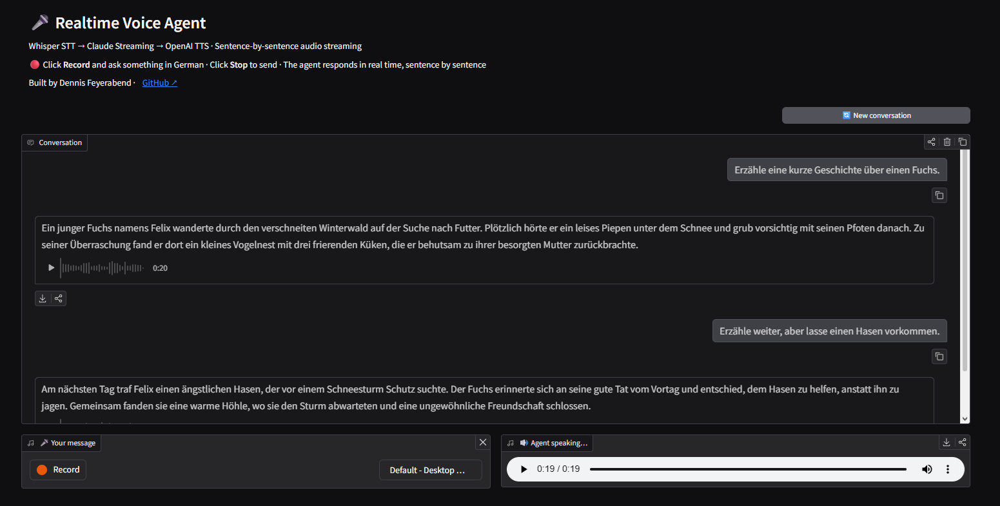

# 🎤 Realtime Voice Agent

A streaming voice conversation agent — speak into your browser, get an AI voice response in real time.

Built with **Whisper STT → Claude Streaming → OpenAI TTS**, with sentence-by-sentence audio streaming for low perceived latency.

**Showcase project** — built during the [Morphos GmbH](https://adz-weiterbildung.de) advanced AI engineering program (March 2026).

---

## Try It Live

**[▶ Open the Voice Agent](https://realtime-voice-agent-production.up.railway.app/)**



**How to use:**
1. Click **Record** and ask something in German
2. Click **Stop** to send your message
3. The agent responds in real time — you'll hear each sentence as it's generated
4. Say **"Stop"** or **"Ende"** to end the conversation
5. Click **New conversation** to start fresh

The agent remembers context within a conversation — ask follow-up questions and it will reference what was said before.

---

## How It Works

Three API calls in a pipeline per turn:

```
🎙 Browser Microphone
       │
       ▼
┌─────────────────────────────┐
│   Whisper STT (OpenAI API)  │  Audio → Text
└──────────────┬──────────────┘
               │
               ▼
┌─────────────────────────────┐
│   Claude (Anthropic API)    │  Text → Text (streaming via SSE)
│   Token by token            │
└──────────────┬──────────────┘
               │  Sentence boundary detected
               ▼
┌─────────────────────────────┐
│   OpenAI TTS                │  Text → Audio (fired per sentence)
└─────────────────────────────┘
```

### Sentence-by-Sentence Streaming

This is the core optimization. Instead of waiting for Claude's full response before generating audio, each sentence is sent to TTS the moment it's complete:

```
Claude streams:  [Sentence 1 ......] [Sentence 2 ......] [Sentence 3 ......]
TTS fires:       [▶ Sentence 1     ]
                                     [▶ Sentence 2     ]
                                                         [▶ Sentence 3     ]
```

First audio plays after **~1–2 seconds** instead of **~10 seconds** for a typical 3-sentence response.

Sentence boundaries are detected via regex (`[.!?]\s`) on the incoming token stream. `agent.py` yields each completed sentence as a generator — the caller decides what to do with it (play audio, stream to browser, collect for API response).

---

## Architecture

Four entry points share the same core modules:

| Layer | File | Purpose |
|---|---|---|
| **Web UI** | `app.py` | Gradio — browser mic, session state, audio streaming |
| **REST API** | `server.py` | FastAPI — stateless HTTP endpoints for testing + clients |
| **CLI** | `main.py` | Local mic + speakers, direct module calls |
| **Deployment** | `deploy.py` | Mounts Gradio + FastAPI on a single port for Railway |

All entry points import the same modules (`stt.py`, `tts.py`, `agent.py`). The modules don't know who's calling them.

---

## REST API (FastAPI)

The FastAPI server runs alongside Gradio on the same deployment and provides programmatic access to all pipeline steps.

**Swagger UI:** [realtime-voice-agent-production.up.railway.app/api/docs](https://realtime-voice-agent-production.up.railway.app/api/docs)

### Endpoints

| Method | Path | Input | Output |
|---|---|---|---|
| GET | `/api/` | — | Welcome message + endpoint list |
| GET | `/api/health` | — | Status, uptime, environment |
| POST | `/api/tts` | JSON `{text}` | Raw WAV audio bytes |
| POST | `/api/stt` | WAV file upload | JSON `{text}` |
| POST | `/api/agent/text` | JSON `{text, history}` | JSON `{response, sentences, history}` |
| POST | `/api/pipeline` | WAV file upload | JSON with transcription + agent response |

The agent endpoint accepts and returns conversation history — stateless multi-turn (the client manages history). The pipeline endpoint runs the full STT → Agent → TTS chain in a single request.

`deploy.py` handles the unified deployment: it creates a root FastAPI app, mounts `server.py` under `/api`, and mounts the Gradio demo at `/` — all on one port.

---

## Project Structure

```
realtime-voice-agent/
├── app.py                  # Gradio web UI (browser mic → streaming audio)
├── server.py               # FastAPI REST API
├── deploy.py               # Unified entrypoint: Gradio + FastAPI on one port
├── main.py                 # CLI voice loop (local mic + speakers)
├── stt.py                  # Speech-to-Text (Whisper API + mic recording)
├── tts.py                  # Text-to-Speech (OpenAI TTS, in-memory audio)
├── agent.py                # Claude streaming (yields sentences via generator)
├── config.py               # Models, audio params, prompts, stop words
├── cleanup.py              # Utility: deletes local WAV files
├── Dockerfile              # Container setup for Railway deployment
├── .dockerignore
├── requirements.txt
├── .env_example            # Template for API keys
├── docs/
│   └── screenshot.png      # Gradio UI screenshot
├── recordings/             # CLI only: per-turn user audio
└── outputs/                # CLI only: per-turn agent audio
```

Each pipeline module (`stt.py`, `tts.py`, `agent.py`) has its own `if __name__ == "__main__"` block for independent testing.

---

## Tech Stack

| Technology | Purpose |
|---|---|
| **Anthropic Claude** | Agent reasoning (Claude Sonnet 4, streaming via SSE) |
| **OpenAI Whisper** | Speech-to-text transcription |
| **OpenAI TTS** | Text-to-speech synthesis (voice: nova) |
| **Gradio** | Browser-based voice UI with audio streaming |
| **FastAPI** | REST API with auto-generated Swagger docs |
| **Docker** | Containerized deployment |
| **Railway** | Cloud hosting |
| **sounddevice** | Local mic recording + audio playback (CLI) |
| **Python 3.12** | Runtime |

---

## Local Development

### Prerequisites

- Python 3.12+
- API keys for [OpenAI](https://platform.openai.com/) and [Anthropic](https://console.anthropic.com/)
- A microphone (for CLI mode)

### Setup

```bash
git clone https://github.com/DennisFeyworoth/realtime-voice-agent.git
cd realtime-voice-agent

python -m venv .venv
source .venv/bin/activate       # macOS/Linux
.venv\Scripts\activate          # Windows

pip install -r requirements.txt
cp .env_example .env            # Add your API keys
```

### Run the Gradio UI locally

```bash
python app.py                   # → http://localhost:7860
```

### Run Gradio + FastAPI together (same as deployment)

```bash
python deploy.py                # → http://localhost:8000 (UI + /api/docs)
```

### Run the CLI voice agent

```bash
python main.py
```

Speak into your microphone. The agent responds through your speakers. Say "stop" or "ende" to exit.

### Test individual modules

```bash
python stt.py          # Record from mic → transcribe → print text
python tts.py          # Generate + play a test sentence
python agent.py        # Text chat with Claude in the terminal
```

### Docker

```bash
docker build -t realtime-voice-agent .
docker run -p 8000:8000 --env-file .env realtime-voice-agent
```

---

## Author

**Dennis Feyerabend** · March 2026

---

## Links

- **Live Demo:** [realtime-voice-agent-production.up.railway.app](https://realtime-voice-agent-production.up.railway.app/)
- **API Docs:** [realtime-voice-agent-production.up.railway.app/api/docs](https://realtime-voice-agent-production.up.railway.app/api/docs)
- **GitHub:** [github.com/DennisFeyworoth/realtime-voice-agent](https://github.com/DennisFeyworoth/realtime-voice-agent)

---

## License

MIT
